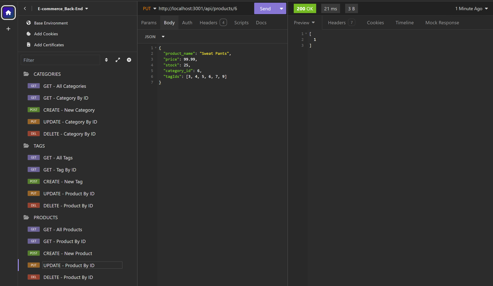

  # E-Commerce_Back-End
  [](./LICENSE)

  ## Description
  This is my 13-Challenge. In this challenge I was given starter code that had the layout of the DOM and the skeleton of routes created. I had to create the models for the psql tables and create most of the queries in the routes. I then needed to test all of the routes in insomnia to make sure they all worked correctly.

  ## Table of Contents 
  * [Installation](#installation)
  * [Usage](#usage)
  * [License](#license)
  * [Contributing](#contributing)
  * [Tests](#tests)
  * [Questions](#questions)

  ## Installation
  To install necessary dependencies, run the following command:
  ```
  npm i
  ```
  ## Usage  
  *** **[Click Here - Video Demonstration](https://drive.google.com/file/d/1g8w_-Pr7VXUraHb0diG3jzDLMulCMzj4/view?usp=drive_link)** ***  
   
  To run the application you will need to create the ecommerce_db, I uesed PostgreSQL.  
  In the file DOM you can edit the **`.env`** file to hold your user name and password.  
  You will need a development platform, I used Insomnia to test the routes.

  On the terminal enter: 
  1. **`psql - U <username>`** - enter your password when prompted.  
  2. **`\i db/schema.sql`** - This will create the ecommerce_db. To exit type **`/q`**  
  3. **run seed`** - this will seed the ecommerce_db.  
  4. **`npm start`** = this will run the application.  
  5. Use Insomnia to monitor http://localhost:3001/  and test the routes.  
   
  <u>**Routes:**</u>  
  /api/categories  
  ```
  {  
    "category_name": "Pants"  
  }
  ```
  /api/products
  ```
  {
    "product_name": "Sweat Pants",
    "price": 99.99,
    "stock": 25,
    "category_id": 6,
    "tagIds": [3, 4, 5, 6, 7, 9]
  }
  ```  
  /api/tags  
  ```
  {  
    "tag_name": "Pants"  
  }
  ```

 
    
  Image example of what to expect in Insomnia.\
  

  ## License
  This project is licensed under the **[MIT](./LICENSE)** license.

  ## Contributing
  N/A

  ## Tests
  To run tests, run the following command:
  ```    
  N/A
  ```
  ## Questions
  If you have any questions about the repo, open an issue or contact me directly at **rhinosstuff@gmail.com**.
  
  You can explore my other projects on GitHub **[rhinosstuff](https://github.com/rhinosstuff)**.
  
  